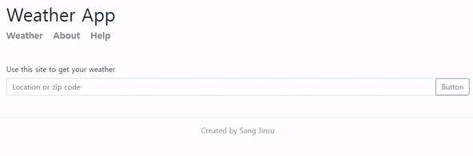

# Weather App

### 변경 사항

- fetch -> axios
- async/await 활용
- bootstrap 적용

[weather app](https://sangjinsu-weather-app.herokuapp.com/) 



## Asyncronous Node.js

- 실행 순서

  ```js
  const locationlist = (locations) => {
    locations.forEach((location) => console.log(location))
  }
  
  const locations = ['seoul', 'incheon', 'gwanju']
  
  locationlist(locations)
  ```

  1. `main()` 함수가 call stack 에 가장 먼저 쌓인다
  2.  `locationlist()` 함수가 call stack에 쌓인다
  3. `forEach()` 가 call stack에 쌓인다
  4. 익명 함수 `anonymous('seoul')` 이 call stack에 쌓인다
  5. `console.log('seoul')`이 call stack에 쌓인다
  6. 5번 실행 후 3번 4번을 다시 실행하고 FILO 으로 call stack이 비워진다
  
  ```js
  console.log('start')
  
  setTimeout(() => {
      console.log('two')
  }, 2000)
  
  setTimeout(() => {
      console.log('zero')
  }, 0)
  
  console.log('finish')
  ```
  
  1. `main()` 함수가 call stack 에 가장 먼저 쌓인다
  2. `console.log('start')` 가 call stack 에 쌓였다가 빠져나간다
  3. 첫번째 `setTimeout` 이 call stack에 쌓였다가 Node APIs 로 빠져나가 2초를 대기한다
  4. 두번째 `setTimeout`이 call stack에 쌓였다가 Node APIs 로 빠져나가 0초를 대기한다\
  5. 두번째 `setTimeout`이 callback queue 에 쌓인다
  6. `console.log('finish')`가 call stack 에 쌓였다가 빠져나간다
  7. `main()` 함수가 call stack에서 빠져나가고 call stack이 빈다
  8. callback queue에 있던 두 번째 `seTimeout`이 event loop를 통해 call stack으로 이동한다
  9. 첫 번째 `setTimeout`이 callback queue 에 쌓인다
  10. 두 번째 `setTimeout` 내부 `console.log('two')` 이 실행되며 call stack이 빈다
  11. callback queue에 있던 첫 번째 `seTimeout`이 event loop를 통해 call stack으로 이동한다
  12. 첫 번째 `setTimeout` 내부 `console.log('zero')` 이 실행되며 call stack이 빈다

---

## encodeURIComponent

- 해당 함수는 URI 특정 문자를 UTF-8로 인코딩해 연속된 이스케이프 문자로 나타냅니다.

 > ```
  > A-Z a-z 0-9 - _ . ! ~ * ' ( )
  > ```

- 위 문자들을 제외한 문자를 이스케이프합니다

